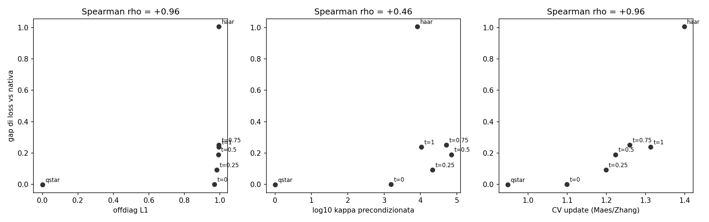

# Your LLM has a privileged coordinate system, and Adam is counting on it

## In plain language (read this first)

A neural network stores its knowledge as big tables of numbers. Those tables
can be written in many equivalent ways — like the same physical quantity
expressed in metres or in feet. Mathematically, some of these rewritings
("rotations of the coordinates") leave the network's behaviour **exactly**
unchanged: same inputs, same outputs, to the last decimal.

So here is the question this project asks: **if two versions of a model are
provably the same function, does the training algorithm treat them the
same?**

For the simplest algorithm (SGD), yes — we prove it and then measure it: the
two training curves coincide to four decimal places. For the algorithm
everyone actually uses (AdamW), **no**: the rotated copy trains worse, needs
a 3× smaller learning rate to stay stable, and can end up a full point of
loss behind — even though it is the same model.

Why? Because AdamW makes an implicit assumption: it treats each number in the
tables as an independent knob to be tuned separately. That assumption is
only good when the coordinates are "the right ones". And it turns out the
coordinates a pretrained model comes with are the right ones *precisely
because* AdamW itself created them during pretraining. The optimizer builds
a coordinate system tailored to its own blind spot, and then depends on it.

We then show three more things: (1) we can build a good coordinate system
from scratch, using only gradients, and it recovers ~75% of the damage of a
scrambled model; (2) rotation strength can be turned into a continuous dial
with a smooth dose–response; (3) among three candidate "thermometers" that
predict the damage without training, the one proposed by Maes, Zhang et al.
(NeurIPS 2025) wins — including against our own two attempts.

Everything ran on one rented GPU for about $15.

---

## Glossary (the six words you need)

| Term | What it means here |
|---|---|
| **Basis / coordinates** | The particular way the model's numbers are laid out. Many layouts describe the same model. |
| **Rotation (Q)** | A specific kind of change of coordinates that preserves lengths and angles. Rotating the "residual stream" of a transformer and compensating in the adjacent weights leaves the function *exactly* unchanged. We call such a rotation *function-preserving* (a "gauge" transformation). |
| **Twin** | A copy of the model rewritten in rotated coordinates. Same function, different numbers. |
| **Learning-rate window** | The range of step sizes at which training works. A narrower window means the optimizer is more fragile. |
| **Fisher matrix** | A table that says which directions in parameter space actually change the model's predictions, and by how much. Adam approximates it by its diagonal. |
| **Kurtosis** | A statistic that is 3 for a bell curve and larger when a few values are enormously bigger than the rest. Here: "are a few coordinates carrying most of the energy?" |

---

## 1. Why the question has a clean answer available

A transformer's residual stream — the running vector that passes through all
the layers — has no privileged coordinate system *by architecture*. For any
orthogonal matrix Q you can rewrite every weight matrix that reads from the
residual stream as W → WQ, every matrix that writes to it as W → QᵀW, and the
embedding as W_E → W_E Q. After absorbing the RMSNorm gains into adjacent
weights, the result computes the *same function*, logit for logit. This is the
same invariance QuaRot and SpinQuant exploit for 4-bit quantization.

*In plain terms:* we can produce a second copy of the model that is
guaranteed identical in behaviour, and only differs in the layout of its
numbers.

Does the optimizer care? On paper: SGD does not. Its update commutes with the
rotation, (W − η∇)Q = WQ − η∇Q, so training the twin is exactly the rotation
of training the original. Global-norm gradient clipping and decoupled weight
decay commute too. AdamW does *not*: it squares the gradient element by
element, and (∇Q)⊙(∇Q) ≠ (∇⊙∇)Q — the square of a mix is not the mix of the
squares.

The magnitude of the effect was measured for *pretraining from scratch* by
Maes, Zhang et al. (2024) — see §5. What this project measures is the
complementary regime: a *pretrained* checkpoint, whose basis was itself
carved by Adam, rotated by an exactly function-preserving transformation —
which is what makes the SGD control below a true oracle.

## 2. Setup

- **Model:** SmolLM2-135M (Llama-style: RMSNorm, RoPE, GQA, tied embeddings —
  untied before norm absorption). Full fine-tuning, fp32.
- **Twins:** `orig` = pretrained weights with RMSNorm gains absorbed;
  `rot` = the same, rotated by a random orthogonal Q (d = 576). Both
  constructed in float64 and verified: max relative logit deviation ~1e-5
  across 64 inputs.
- **Data:** wikitext-2, tokenized once and cached. The data-order seed is
  shared between twins, so *seed variance measures noise* while *the twin gap
  measures the effect*. Held-out eval set of 32 fixed blocks.
- **Determinism:** `torch.use_deterministic_algorithms`, fixed CUBLAS
  workspace, fp32 throughout.

## 3. Results

### 3.1 The oracle: SGD control

400 steps of SGD, same LR, both twins: |Δloss| averages **6e-5**, max
**1.7e-4** (fig1). That is the accumulated fp32 rounding error and nothing
else.

*In plain terms:* theory says these two curves *must* coincide. They do.
That certifies the whole pipeline — rotation, norm absorption, data order,
determinism — in one shot. From here on, any AdamW gap above ~1e-3 is signal,
not bug. Most ML experiments have no such correctness check; the symmetry
gives us one for free.

### 3.2 AdamW, cold start: a violent transient

Same protocol with AdamW (lr 3e-4, 3 data seeds per arm): the rotated twin's
loss explodes from 3.0 to ~7–8 within the first ~25 steps, then slowly
recovers to a persistent ~0.3 gap (fig2).

*In plain terms:* with empty statistics, Adam's first steps are essentially
"move every number by a fixed amount, up or down according to the sign of its
gradient". The pattern of signs is *not* preserved by rotation, so the initial
kick is a genuinely different perturbation in the two bases — and in one of
them it is destructive.

### 3.3 AdamW with warmup: the transient dies, the gap survives

Adding 50 warmup steps kills the explosion entirely but leaves a stable
~0.35 eval-loss gap from step ~75 onward (fig4, seed bands non-overlapping).

*In plain terms:* we switched off one possible cause (the cold start) and the
effect stayed. So it is not a start-up artefact; it is steady-state.

### 3.4 The dose–response curve (main result)

LR sweep with warmup, tail-mean training loss over the last 50 steps:

| LR    | original | rotated | gap  |
|-------|----------|---------|------|
| 1e-5  | 2.76     | 2.76    | ~0   |
| 3e-5  | 2.73     | 2.77    | 0.04 |
| 1e-4  | 2.78     | 2.92    | 0.14 |
| 3e-4  | 3.11     | 4.12    | 1.01 |

*In plain terms:* at tiny step sizes both twins behave the same; as the step
size grows, the rotated twin falls behind, then collapses. The rotation does
not move the best achievable loss — it **shrinks the range of step sizes you
can use** by about 3×. That is the fingerprint of a *conditioning* problem:
the same landscape looks well-behaved in one set of coordinates and
treacherous in another, and Adam's diagonal shortcut only works in the
former. (Replication: a second, independent random rotation lands at 2.918
vs. 2.92 at lr 1e-4 — the effect is a property of *changing basis*, not of
one unlucky Q.)

### 3.5 Mechanism, part 1: outlier dimensions

Kurtosis of per-column weight norms (Gaussian = 3):

| model            | mean | max   |
|------------------|------|-------|
| original         | 17.7 | 120.2 |
| randomly rotated | 3.4  | 8.3   |

*In plain terms:* in its native coordinates the model concentrates enormous
energy in a handful of dimensions — the well-known "outlier dimensions", the
same structure QuaRot has to smooth out to quantize. A random rotation spreads
that energy evenly and the outliers vanish.

### 3.6 Mechanism, part 2: the native basis diagonalizes the task Fisher

Attempted method: estimate the d×d residual-stream block of the task Fisher
(accumulate GᵀG over readers and GGᵀ over writers, 64 batches), rotate the
model into its eigenbasis Q*, and fine-tune. If Adam's diagonal shortcut is
the bottleneck, the Fisher eigenbasis should be the best possible
coordinates.

Result: **Q\* exactly matches the native basis at every LR** — including
3e-4, where the random rotation collapses. And Q* is a *dense* rotation
(mean column peak 0.19, participation ratio 130/576), not a relabelling: it
scrambles coordinates as thoroughly as the random Q does, yet lands on
native-level performance, and the resulting model is again
outlier-concentrated (kurtosis 15.4, max 177).

*In plain terms:* what Adam needs is not "the original axes" — it is **any
set of axes along which the Fisher matrix is nearly diagonal**. The native
basis of an Adam-pretrained checkpoint already is one. The coordinate system
of your model is not a convention; it is a fossil record of the optimizer
that created it. As an accelerator the method is therefore useless on a
healthy checkpoint: there is nothing left to diagonalize. Honest negative.

### 3.7 Repair: recovering broken coordinates

Take the randomly rotated twin (the 4.12 collapse), estimate *its* Fisher,
rotate into *its* eigenbasis, fine-tune at lr 3e-4:

| model                     | tail loss @ 3e-4 |
|---------------------------|------------------|
| original                  | 3.11             |
| randomly rotated          | 4.12             |
| rotated → Fisher-repaired | **3.37**         |

*In plain terms:* ~75% of the damage undone, at zero runtime cost, without
any knowledge of the original rotation — purely from the gradients of the
broken model. The missing 25% is consistent with estimation noise (64
batches; the eigenvectors of near-equal eigenvalues are unstable) and with
the single-global-Q constraint. Models that live in scrambled coordinates
exist in the wild: QuaRot/SpinQuant checkpoints fine-tuned for quantization
are exactly this case.

### 3.8 A continuous dial, and a three-way test of "thermometers"

To turn rotation strength into a **continuous dial**, take a random
antisymmetric A (rescaled to spectral norm π) and set Q(t) = exp(tA):
orthogonal — hence exactly function-preserving, logit-checked — for *every*
t ∈ [0, 1]. Training each Q(t) twin (AdamW, lr 3e-4, warmup):

| t    | 0 | 0.25 | 0.5  | 0.75 | 1.0  | (random, ref.) |
|------|---|------|------|------|------|----------------|
| gap  | 0 | 0.09 | 0.19 | 0.25 | 0.24 | 1.01           |

*In plain terms:* damage grows smoothly with rotation strength — no threshold,
no cliff. (Q(1) is milder than a fully random rotation, which is why its
damage is smaller.)

These 7 bases (native, four Q(t), random, Q*) then serve as a test bed for
**three candidate predictors of the damage** — quantities you can compute
*without training*, that should tell you in advance how well Adam will do:

| predictor | source | Spearman ρ with gap | verdict |
|---|---|---|---|
| L1 off-diagonal mass of the rotated Fisher block | this project, first attempt | +0.96 (inflated) | **fails where it matters**: gives the random rotation and Q(1) values identical to the 4th decimal (0.99458 vs 0.99457) while their damages differ 4× (1.01 vs 0.24). The high ρ is carried almost entirely by the Q* point. Descriptive, not predictive. |
| log-condition-number of the diagonally-preconditioned Fisher | this project, second attempt | +0.46 | **fails outright**: non-monotone even inside the Q(t) family. Dominated by the smallest eigenvalue of a 64-batch estimate, which is sampling noise. A theoretically motivated but statistically fragile proposal. |
| coefficient of variation of the singular values of Adam's effective update m̂/(√v̂+ε), per layer | Maes, Zhang et al. (2024), their §4.2 | +0.96 | **wins**: orders all 7 points correctly (the single t=0.75/t=1 inversion is within single-seed noise), *separates* the random rotation (CV 1.399) from Q(1) (1.313) where the L1 metric saturates, and places Q* (0.948) below even the native basis (1.099). |



*In plain terms:* a good thermometer must give different readings to
patients with different illnesses. Our first metric gives the same reading to
a mildly and a severely damaged model; our second one is erratic; the metric
from Maes, Zhang et al. — "how uniform are the singular values of Adam's
step?" — ranks all seven correctly.

The last number is the punchline:

> **CV(Q\*) = 0.948 < CV(native) = 1.099.** The Fisher eigenbasis produces
> Adam updates *more uniform than the native basis itself*. That welds the two
> stories into one: diagonalizing the residual Fisher ⟹ decorrelated
> gradients along the residual index ⟹ sane per-coordinate scale estimates
> ⟹ more uniform update singular values. Their metric *measures* how good a
> basis is; the Fisher eigenbasis of §3.6 is a **constructive procedure** for
> manufacturing a good one from gradients alone. Their thermometer, our knob.

**Falsification test.** If CV were the whole story, Q* — with a *better* CV
than native — should tolerate a slightly higher LR. Tested at lr 6e-4 (single
seed): native tail 3.56, Q* tail 3.61; both degrade (6e-4 is outside the
window for both); Q* is somewhat more stable early (max spike 4.09 vs 4.48)
but ends nominally worse. **Verdict: parity within single-seed noise.** The
metric ranks bad bases well, but does not discriminate between two good ones.
Both outcomes were pre-registered; this is the honest one.

## 4. What this does NOT show

- **No speedup for normal fine-tuning.** If your coordinates are fine, leave
  them alone. The 6e-4 test confirms it from the other side.
- **One model (135M), one task (wikitext-2), short runs (400 steps).** The
  mechanism should transfer (the symmetry and Adam's elementwise structure are
  universal); the magnitudes may not.
- **Single-seed points.** The Q(t) sweep and the 6e-4 test are one seed each;
  the seed band at 3e-4 is roughly ±0.1, so differences below that are not
  interpreted anywhere in this document.
- **Fine-tuning only.** Pretraining-from-scratch dynamics, where the basis is
  *being formed* rather than inherited, are untouched here.
- **The Fisher block is layer-averaged.** The gauge constraint forces a
  single global Q; per-layer optimal bases exist but would break functional
  invariance. Maes, Zhang et al.'s per-matrix SVD rotations *improve over*
  native where our single global Q* only *matches* it — evidence that this
  averaging is the binding constraint, not the Fisher-eigenbasis idea itself.

## 5. Relation to prior work

- **Maes, Zhang et al., "Understanding Adam Requires Better Rotation
  Dependent Assumptions" (NeurIPS 2025, arXiv:2410.19964).** The closest
  prior work. They prove SGD's rotation equivariance and Adam's lack of it,
  and show Adam's training loss on GPT-2 and ViT degrades under random
  rotations, with degradation scaling with rotation scope (output-wise <
  input-wise < layer-wise < global); ResNet-50 shows no meaningful
  degradation — the effect is Transformer/Adam specific. Their rotations act
  on the *gradients inside the optimizer* (rotated-Adam on a fixed network);
  ours act on the *model* (plain AdamW on function-identical twins) — two
  complementary views, and only the latter admits the SGD oracle. Their §4.1
  tests existing rotation-dependent assumptions (L∞-gradient bounds; Hessian
  block-diagonality; the (1,1)-Hessian-norm probe of Xie et al., 2025) and
  finds each falls short; their §4.2 proposes **update orthogonality** as a
  promising indicator and calls for formalizing it. **§3.8 here is a direct
  test of that proposal on an independent test bed:** their metric wins
  against two Fisher-based alternatives, including this project's own two
  attempts; and §3.6–3.7 supply what a metric alone cannot — a constructive
  procedure that manufactures high-orthogonality bases from gradients alone.
  A response/extension to their stated open problem, not a parallel finding.

- **Caples & Neuhaus, "Adam Optimizer Causes Privileged Basis in Transformer
  Language Models" (LessWrong).** Shows the "Adam *creates* it" direction
  directly: train from scratch with Adam vs. SGD, measure excess kurtosis —
  the same metric as §3.5, from the opposite side. What the experiments here
  add is the *converse*: Adam also **depends on** the basis it carved.
  Creation and dependence together close the loop.

- **Sareen et al., "The Role of Symmetry in Optimizing Overparameterized
  Networks" (Mila/McGill, 2026, arXiv:2604.25150).** A different symmetry
  (neuron duplication), same picture: symmetry transformations act as
  *diagonal preconditioning* on the Hessian, and the benefit depends on how
  axis-aligned the curvature already is. Their Appendix H finds empirical
  axis-alignment specifically in Transformers and cites Maes/Zhang as the
  reason Adam benefits from it.

- **Dong & Cheng, "Quotient Geometry, Effective Curvature, and Implicit Bias
  in Simple Shallow Neural Networks" (2026, arXiv:2603.21502).** Theory for
  shallow networks; supplies rigorous vocabulary (false vs. intrinsic
  flatness, vertical vs. horizontal gradient components) for what is argued
  informally here.

- **Concurrent: "The Loss Does Not See the Basis, but Adam Does"
  (arXiv:2608.05136, Aug 2026)** studies the *implicit-bias* face of the same
  coin — which solution Adam selects in factored models at matched loss — vs.
  the *training-dynamics* face measured here. No overlap in results.

- **QuaRot / SpinQuant** use the same invariance for inference (4-bit
  quantization); here it is used as an experimental scalpel for training.
- **SOAP** (Vyas et al., ICLR 2025), **ARO** (Gong et al., 2026),
  **PolarAdamW** (arXiv:2605.07067): the optimizer-design thread — dynamic,
  per-matrix, runtime-cost rotations of the optimizer's coordinates. The
  present result is the static, global, zero-cost, function-preserving slice
  of the same geometry, plus the causal measurement those methods do not do.
- **Riemannian-preconditioned LoRA** (Zhang & Pilanci, ICML 2024) and
  **conservation-law analyses** (Kunin et al., "Neural Mechanics") cover the
  GL(r) symmetry of low-rank factorizations; the O(d) residual-stream gauge
  here is the full-model analogue.

## 6. Reproduce

```
pip install -r requirements.txt
bash run_phases.sh 0             # build twins + verify logits (CPU, ~10 min)
bash run_phases.sh 1             # SGD oracle (~30 min L4)
bash run_phases.sh 2             # AdamW, 3 seeds (~2.5 h L4)
bash run_phases.sh 3             # LR sweep (~3 h L4)
python src/fisher_basis.py       # + rotate_model.py --q-file for §3.6–3.7
python src/qt_sweep.py --stage build|fisher|train|orth|analyze   # §3.8
python src/qt_extra.py --stage metrics|cv|scatter                # §3.8 head-to-head
```

Total compute: about 15 credits (about $15) on a Lightning AI L4. Every
number in this README comes out of a CSV in `results*/`.

## 7. Authorship and AI assistance

This project was carried out by an independent researcher (public-sector
financial analyst by profession, MSc in financial mathematics) with
substantial assistance from an AI model (Claude, Anthropic), and it is right
that the division of labour be stated plainly.

**Human:** the originating question ("are gradients covariant, and can a
change of coordinates make training more efficient?"); every design decision
and every choice between alternatives; all execution on the GPU; catching
the bugs that surfaced (a broken dataset path, a diagnostic script whose
automatic verdict was wrong); reading and challenging the results; the
decision of what to publish and what to withhold.

**AI:** drafting the code (every script was run, and its output checked,
before being kept); the mathematical exposition; the literature searches;
and the drafting of this README, which the human edited and takes
responsibility for. Some of the AI's proposals were wrong and are reported
as such in §3.8 — two of the three predictor metrics were AI suggestions
that the data rejected.

Text drafted with Claude may carry the machine-readable marking that
Anthropic applies under the EU AI Act's Article 50 transparency
obligations. This disclosure makes that marking accurate rather than
incriminating: the assistance is real, and so is the human judgement that
directed it. The numbers in this document do not depend on who wrote the
sentences around them — they come from CSVs anyone can regenerate with the
commands above.

---

*Questions, replications, and "you missed this paper" comments welcome —
especially the last kind.*
